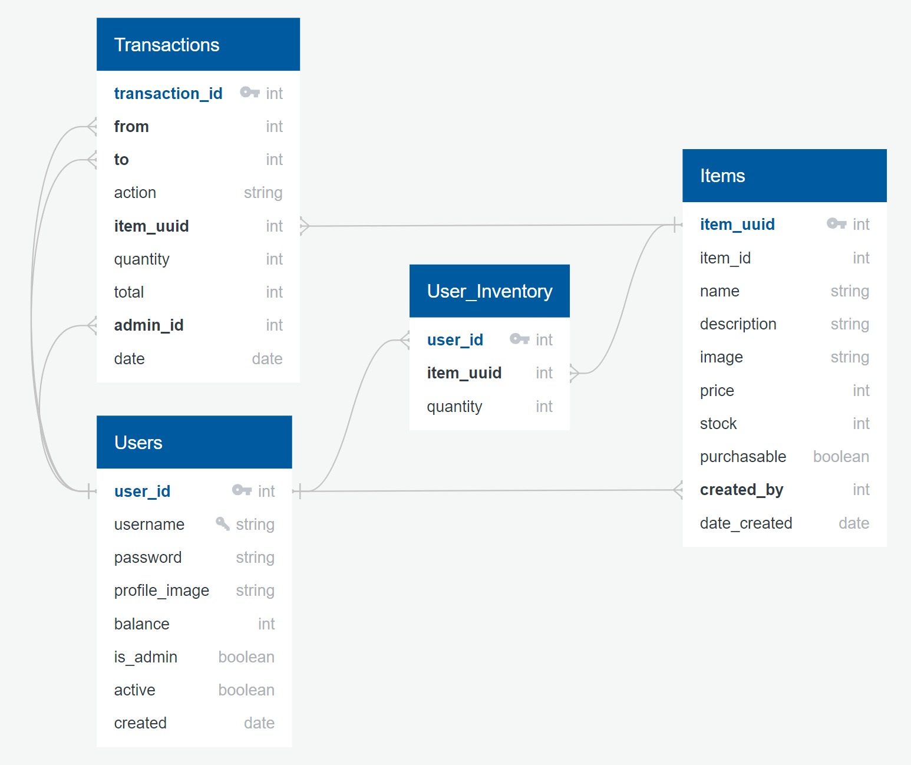

# Shopkeyp
https://shopkeyp-frontend.onrender.com

|  t/f  |         isLoggedIn         |                                       isAdmin                                             |
| :---: | :------------------------: | :---------------------------------------------------------------------------------------: |
| true  |           Logout           | View Users, Edit User Balance/Status/Account Type, View/Edit/Add Items, View Transactions |
| false | View Home, Register, Login | View Shop, Purchase Shop Items, View User Inventory, View User Transactions               |

## Home Page

## Register / Login

## Profile Page

## Shop Page

## Admin Dashboard

### Goal

One of the biggest obstacles for admins in roleplaying games (outside of impactful storytelling) is tracking player economy. As such, the goal of this project is to create an inventory management system where admins can maintain a shop with a fixed economy for users to purchase items and access their inventory.

### Demographics

This application is designed for roleplay gaming commerce with an expected demographic ranging from teens to young adults.

## TechStack

This application is built with Node.js, React.js, MaterialUI, PostgreSQL, Express.js, HTML, CSS, Bcryptjs, Supertest, JSONSchema, JSONwebtoken, Formik, and Axios.

> **Key Features:** Object-Oriented Programming, Database Management, HTML Inheritance, Password Encryption, API Validation, User Authentication, and Integration Testing.

### Testing

Tests are written using Jest and SuperTest.

- Require supertest, app and db
- Set process.env.NODE_ENV === "test"
- Run jest or npm run test from test folder in command line

## Database Diagram

Diagram created with [Quick Database Diagrams](https://app.quickdatabasediagrams.com/#/).

## User Flow

# Getting Started with Create React App

This project was bootstrapped with [Create React App](https://github.com/facebook/create-react-app).

## Available Scripts

In the project directory, you can run:

### `npm start`

Runs the app in the development mode.\
Open [http://localhost:3000](http://localhost:3000) to view it in your browser.

The page will reload when you make changes.\
You may also see any lint errors in the console.

### `npm test`

Launches the test runner in the interactive watch mode.\
See the section about [running tests](https://facebook.github.io/create-react-app/docs/running-tests) for more information.

### `npm run build`

Builds the app for production to the `build` folder.\
It correctly bundles React in production mode and optimizes the build for the best performance.

The build is minified and the filenames include the hashes.\
Your app is ready to be deployed!

See the section about [deployment](https://facebook.github.io/create-react-app/docs/deployment) for more information.

### `npm run eject`

**Note: this is a one-way operation. Once you `eject`, you can't go back!**

If you aren't satisfied with the build tool and configuration choices, you can `eject` at any time. This command will remove the single build dependency from your project.

Instead, it will copy all the configuration files and the transitive dependencies (webpack, Babel, ESLint, etc) right into your project so you have full control over them. All of the commands except `eject` will still work, but they will point to the copied scripts so you can tweak them. At this point you're on your own.
